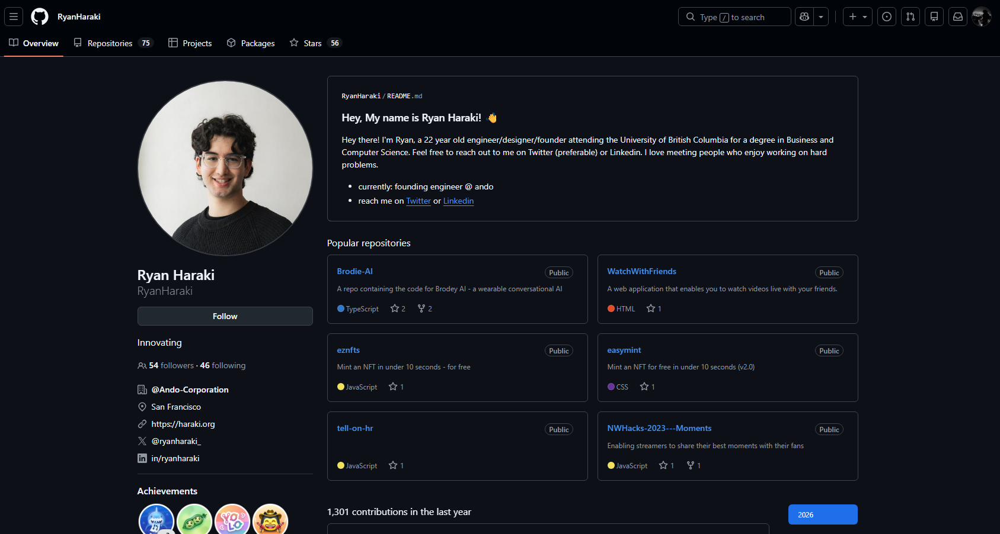

<div align="center">
  
  <h1>Better PDF</h1>
  <p><strong>Free, private PDF tools that run entirely in your browser</strong></p>
  <p>
    <a href="https://better-pdf.com">Website</a> •
    <a href="#features">Features</a> •
    <a href="#getting-started">Getting Started</a> •
    <a href="#tech-stack">Tech Stack</a>
  </p>
  <p>
    
    
    
  </p>
</div>

<br />

<p align="center">
  
</p>

## Why Better PDF?

Most online PDF tools upload your files to their servers. **Better PDF is different** — all processing happens locally in your browser using WebAssembly. Your files never leave your device.

- **🔒 100% Private** — Files never uploaded to any server
- **⚡ Lightning Fast** — No upload/download wait times
- **🆓 Completely Free** — No limits, no watermarks, no signup
- **📖 Open Source** — Audit the code yourself

## Features

| Tool | Description |
|------|-------------|
| **Merge PDFs** | Combine multiple PDF files into one document |
| **Edit PDF** | Add text, images, signatures, and highlights |
| **Split PDF** | Extract specific pages or page ranges |
| **Compress PDF** | Reduce file size while maintaining quality |
| **Protect PDF** | Add or remove password protection |
| **Add Page Numbers** | Customizable position, format, and styling |
| **Watermark** | Add text watermarks to all pages |
| **Sign PDF** | Draw and place your signature |
| **PDF to JPG** | Convert pages to JPG images |
| **JPG to PDF** | Convert images to PDF |
| **PDF to Images** | Export as PNG or JPEG |
| **Images to PDF** | Combine multiple images into PDF |
| **Preview** | View and navigate PDF documents |

### Additional Features

- **Drag & Drop** — Reorder pages by dragging thumbnails
- **Recent Files** — Quick access to recently used files
- **Dark Mode** — Easy on the eyes
- **Mobile Responsive** — Works on all devices
- **Keyboard Shortcuts** — Power user friendly

## Getting Started

### Prerequisites

- [Bun](https://bun.sh/) (recommended) or Node.js 18+

### Installation

```bash
# Clone the repository
git clone https://github.com/milnee/better-pdf.git
cd better-pdf

# Install dependencies
bun install

# Start development server
bun dev
```

Open [http://localhost:3000](http://localhost:3000) in your browser.

### Build for Production

```bash
bun run build
bun start
```

## Tech Stack

| Category | Technology |
|----------|------------|
| Framework | [Next.js 15](https://nextjs.org/) with App Router |
| Language | [TypeScript](https://www.typescriptlang.org/) |
| Runtime | [Bun](https://bun.sh/) |
| Styling | [Tailwind CSS](https://tailwindcss.com/) |
| UI | [Radix UI](https://www.radix-ui.com/) |
| PDF Processing | [pdf-lib](https://pdf-lib.js.org/) |
| PDF Rendering | [PDF.js](https://mozilla.github.io/pdf.js/) |
| Icons | [Lucide](https://lucide.dev/) |
| Linting | [Biome](https://biomejs.dev/) |

## Project Structure

```
src/
├── app/                    # Next.js App Router pages
│   ├── merge/             # Merge PDFs
│   ├── text/              # Edit PDF
│   ├── split/             # Split PDF
│   ├── compress/          # Compress PDF
│   ├── protect/           # Password protection
│   ├── pagenumbers/       # Add page numbers
│   ├── watermark/         # Add watermarks
│   ├── sign/              # Sign PDF
│   ├── pdf-to-jpg/        # PDF to JPG
│   ├── jpg-to-pdf/        # JPG to PDF
│   ├── to-images/         # PDF to images
│   ├── from-images/       # Images to PDF
│   └── preview/           # PDF viewer
├── components/
│   ├── layout/            # Header, footer, toolbar, cards
│   ├── pdf/               # PDF viewer components
│   ├── providers/         # Theme provider
│   └── ui/                # Reusable UI components
└── lib/
    ├── pdf.ts             # PDF manipulation
    ├── render.ts          # PDF.js rendering
    └── download.ts        # File downloads
```

## Privacy & Security

Better PDF takes privacy seriously:

- **Zero Server Processing** — All PDF operations run in your browser
- **No File Uploads** — Your documents never leave your device
- **No Analytics** — No tracking, cookies, or data collection
- **No Account Required** — Just open and use
- **Open Source** — Fully transparent codebase

## Browser Support

| Browser | Version |
|---------|---------|
| Chrome | 90+ |
| Firefox | 90+ |
| Safari | 15+ |
| Edge | 90+ |

## Contributing

Contributions are welcome! Feel free to:

1. Fork the repository
2. Create a feature branch (`git checkout -b feature/amazing-feature`)
3. Commit your changes (`git commit -m 'Add amazing feature'`)
4. Push to the branch (`git push origin feature/amazing-feature`)
5. Open a Pull Request

## License

MIT License — free for personal and commercial use.

---

<div align="center">
  <p>
    <strong>Your documents. Your device. Your control.</strong>
  </p>
  <p>
    <a href="https://better-pdf.com">better-pdf.com</a>
  </p>
</div>
